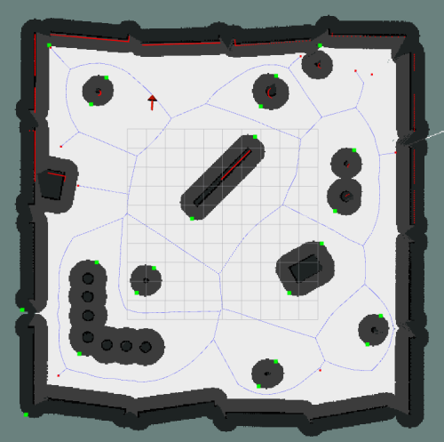

# Shared Voronoi Global Planner

## Description
This global planner generates several paths in homotopically distinct classes (i.e. the paths generated can not be deformed into another without colliding with an obstacle).

This is done using the JCash Voronoi C implementation (https://github.com/JCash/voronoi). The nodes generated by the library is then converted into an adjacency matrix for use in graph-based path finding algorithms.

A* path finding algorithm with Euclidean distance heuristics is used to find the shortest path, subsequent k-th shortest paths are found using Yen's algorithm.

## Example Images

Image above shows the voronoi edges that are generated and used for planning. Red dots indicates nodes that are only connected to 1 other node. Blue lines are the voronoi edges. Green dots are points that lie on obstacles which will later be used to calculate the path's homotopy class.

Image above shows all the alternate paths that are generated using the voronoi diagram. In this example, 10 paths are generated. The different colors represent the different classes in distinct homotopy classes

## Subscribers
`/move_base/global_costmap/costmap [nav_msgs/OccupancyGrid]:` Subcribes to global costmap to generate voronoi diagram

`/move_base/global_costmap/costmap_updates [nav_msgs/OccupancyGrid]:` Subscribes to global costmap updates. This topic is published on when the map is not static, ie gmapping is running.

`/move_base/local_costmap/costmap [nav_msgs/OccupancyGrid]:` Subscribes to local costmap. Local costmap is merged with global costmap during generation of voronoi diagram.

`/user_vel [geometry_msgs/Twist]:` Topic to receive user's direction. Max forward velocity and angular velocity *has to* have the same limits.

## Publishers
`~/merged_costmap [nav_msgs/OccupancyGrid]:` Merged costmap of local and global costmaps. Used for ensuring that the global planner is using the correct map to generate voronoi diagram.

`~/plan [nav_msgs/Path]:` Currently selected path that is being sent to the local planner for execution.

`~/all_paths_viz [visualization_msgs::MarkerArray]:` Visualization markers for all paths generated.

`~/all_paths [shared_voronoi_global_planner::PathList]:` All paths that were generated, along with their unique IDs

`~/user_direction [visualization_msgs::Marker]:` Visualization marker for the current user direction.

`~/voronoi_edges_viz [visualization_msgs::MarkerArray]:` Visualization markers for voronoi edges and singly connected nodes (red points on the map).

## Parameters
`occupancy_threshold:` Integer threshold of costmap pixels before it is considered an occupied cell, which will then be used to generate the voronoi diagram.

`collision_threshold:` Integer threshold of costmap pixels before it is considered a collision. This threshold is used during the pruning of generated voronoi edges, as well as during path smoothing.

`trimming_collision_threshold:` Integer threshold of costmap pixels before it is considered an occupied cell during the trimming/contraction of generated paths. Prevents the paths from contracting too near to an obstalce.

`update_voronoi_rate:` Rate at which to update the voronoi diagram, Hz.

`print_timings:` Set true to print all timing related information into the console. Mainly for debugging/optimization purposes.

`line_check_resolution:` Pixel resolution to increment during checking of collision. Value of 0.5 will check if a line has a collision every 0.5 pixels. Floating point pixels are cast to integer before checking, therefore this parameter might have little effect.

`pixels_to_skip:` Pixels to skip when reading through the costmap to get occupied cells for voronoi diagram generation. 0 means all pixels will be read. 1 means for every 1 pixel read, 1 pixel will be skipped before reading again.

`open_cv_scale:` Used to downscale the costmap image for faster performance during finding of obstacle centroids. Value ranges from 0 to 1.0, exclusive.

`h_class_threshold:` Percentage threshold used to classify if a path is of a different h_class. A value of 0.01 means a 1% difference is sufficient to classify a path in another class. Note that only small values are required for this.

`min_node_sep_sq:` Minimum distance in meters squared between 2 points. This is used during the smoothing phase of the generated voronoi paths. A value of 1 means that if 2 subsequent nodes in the generated voronoi path is less than 1 pixel apart, the smoothing will delete the pixels until 2 subsequent nodes are greater than 1 pixel apart.

`extra_point_distance:` Distance (m) to place the extra point during the bezier smoothing to ensure continuity of the smoothed path. This param is currently quite hardcoded, in the sense that this distance should be a function of something else, but is not yet implemented. Default value is 1.0.

`add_local_costmap_corners:` Option to add the 4 corners of the local costmap as virtual obstacles. This helps to generate a voronoi diagram even in an empty field when no other obstacles are detected.

`forward_sim_time:` This value affects the length of user direction, which plays a part in selecting the closest matching path to the user's direction.

`num_paths:` Number of paths to generate. Note that the number of paths generated greatly affects the performance of the global planner.

`publish_all_path_markers:` Set true to publish markers for all the paths.

`user_dir_filter:` Exponential filter on the user's direction. Default value is 0.0

`joystick_topic:` Topic to subscribe to for joystick values. Topic should be of type geometry_msgs/Twist

`visualize_edges:` Set true to publish all voronoi edges and singly-connected nodes to rviz. Note that occasionally the edges might spasm, but this only happens to the visualization, internally the edges are still correct.

`node_connection_threshold_pix:` Since the voronoi library generates nodes in terms of pixels, and in order to get the adjacency list, the nodes have to be "discretized" and given a unique hash; occasionally, nodes that are next to each other, which are technically the same node, will not be given the same hash. This param fixes the issue by finding singly connected nodes in the adjacency list, then connects it to the nearest node if it less than this param's threshold. This prevents broken edges in the adjacency list.

`joy_max_lin:` Maximum joystick linear velocity, used to normalize joystick input to be able to get correct angle of joystick.

`joy_max_ang:` Maximum joystick angular velocity, same usage as joy_max_lin.

`search_radius:` The radius in meters in which to search the robot's current position to find an empty cell, if the robot is inside the inflation zone of an obstacle during the replanning of paths.

`subscribe_local_costmap:` Whether or not to subscribe to local costmap, this should work in tandem with cases when *update_voronoi_rate* is not set to 0

`static_global_map:` Whether the global map is static, ie not running mapping. If this is set to false, then *update_voronoi_rate* needs to be set to greater than 0

`xy_goal_tolerance:` If the robot is within this distance (m) from the goal, and there are already paths found from a previous time step, the global planner will not do any replanning and instead just return the paths found in previous time step. This is to overcome the issue where if the global planner's replanning rate is too high, move base is unable to trigger "GOAL REACHED" even when already at the goal.

`selection_threshold:` Percentage threshold in float (1.2 = 120%) in which paths with matching scores within this threshold (compared to the closest matching path) will be added to the list of paths that could be selected. For example, given that there are 4 paths, and the user indicates a specific direction. After calculation how close each path's first segment matches the user's direction, a score array of [1, 1.1, 4, 3.3] is found. In this case, if this parameter is set to 1.2, paths 1 and 2 (scores 1 and 1.1) will be added to list of paths to be considered. 

Scaled score of path 1 is 1, because it has the minimum score. Whereas scaled score of path 2 is 1.1/1 (this path's match score / shortest path's match score).

Among the list of paths to be considered, the path that is physically shorter will be selected. This parameter aims to solve the issue where if there were several paths with identical starting segments, it's more likely the user would select the path that is shorter in that direction, instead of the longer one.

`odom_topic:` Odometry topic. Used to subscribe to position of robot

`sorted_nodes_dist_thresh:` This threshold determines how often the sorted nodes list topic is published. When the robot's current position is this threshold away from the previous time that sorted nodes was published, then sorted nodes will be updated and republished again. Units (m)

`lonely_branch_dist_threshold:` Meters squared threshold to traverse a lone branch before halting. If the threshold is not reached before reaching a branching node, then the entire lone branch will be deleted. Set to 0 to disable lone branch pruning.

`path_waypoint_sep:` Minimum distance between waypoints of global path, if 2 waypoints are closer than this separation, they will be deleted. This parameter does not guarantee that waypoints on paths generated are uniformly separated based on this value. Increasing this separation reduces replanning time. Units(m)

`joy_sel_thresh:` Input joystick's threshold magnitude percentage (with respect to joystick specified max linear and angular velocities) before the input is considered a path selection input, and not just a control input